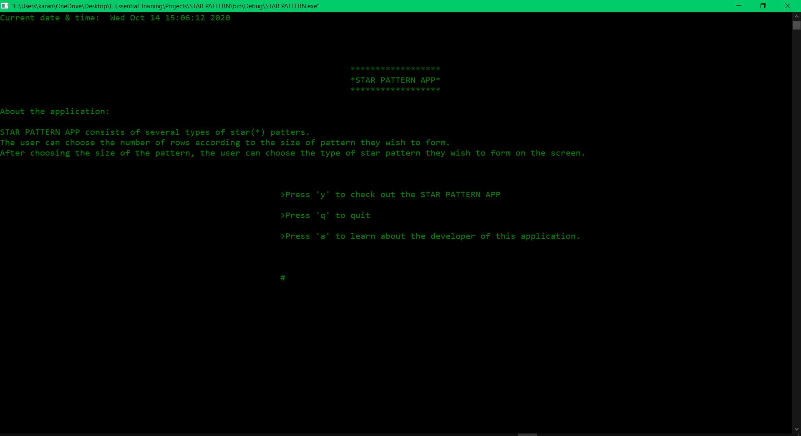
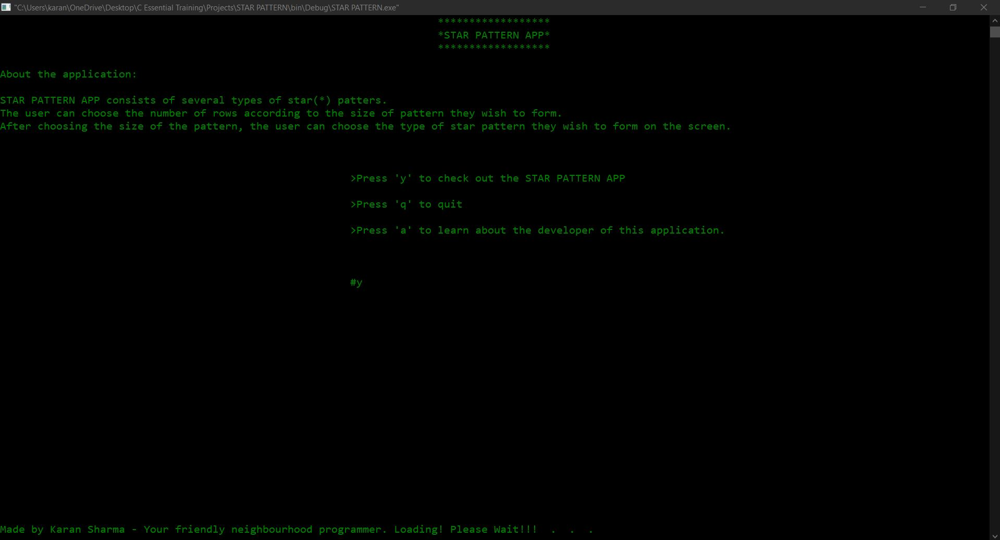
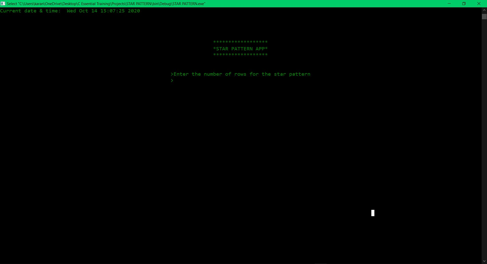
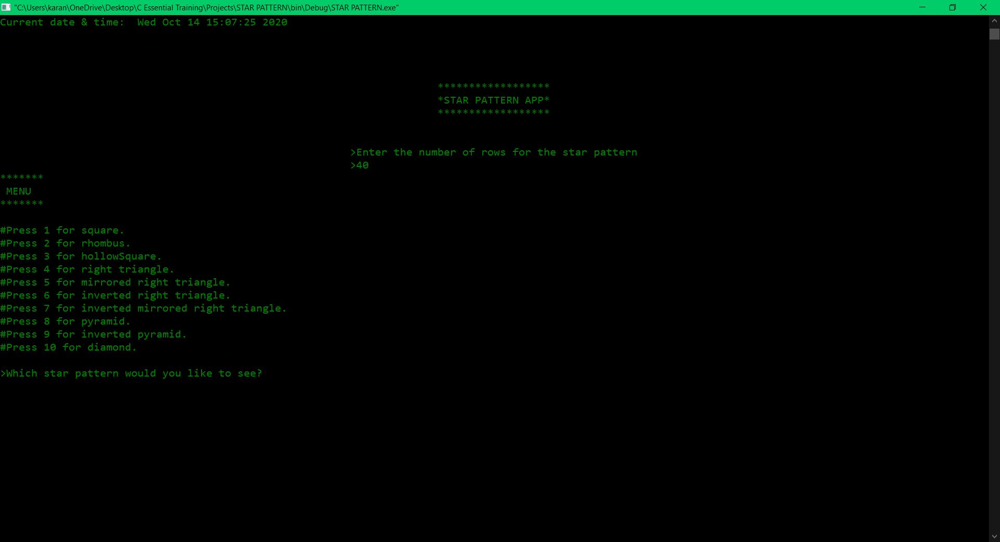
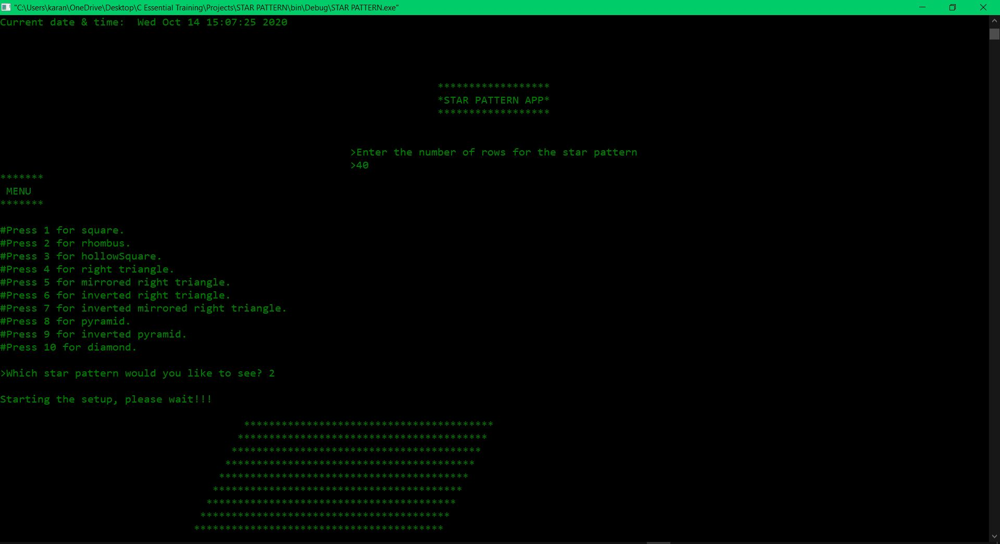
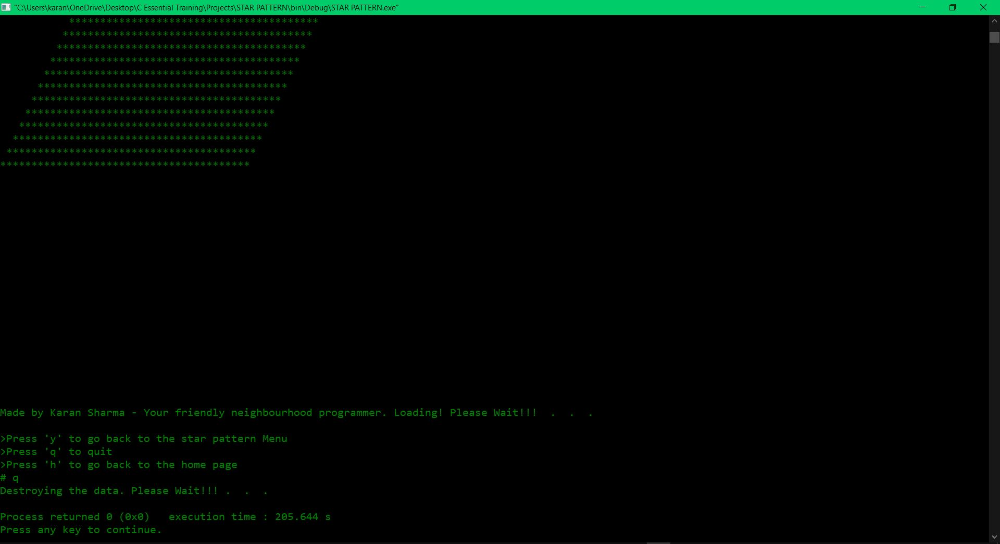

# Star_Pattern_App-C_DEVelopment

Star Pattern App is a console application which prints several star patters as requested by the user.

This is an individual project. This project is an original idea.

This console application is divided into four sections:

1. Main.c - This file contains the main function and the retry main function. Main function is where the user chooses to start the app, quit the app or learn about the developer.
            Retry main is the function which is called when the user chooses a wrong option.
            
2. Formatting.c - This file contains date_time function, logo function, footer function and the loading function. date_time function is called when a new page is being loaded and                   it shows system's current date and time. Same goes for logo function which shows the logo of the app, footer function which shows author's name and loading                         function which shows loading symbol.

3. Menu.c - This file contains two functions - display function and retrydisplay function. display function is a menu of 10 different star pattern options where the user chooses               the star pattern they would like to output. retrydisplay function is called when the user inputs wrong option in the display function to retry the same menu again and             again.

4. starFunctions.c - This file contains 12 functions - square, rhombus, hollowSquare, rTriangle, lTriangle, inverted_R_Triangle, inverted_L_Triangle, pyramid, invertedPyramid                          Diamond, aboutMe and retryAboutMe funtion. Square - Diamond functions all contain nested for loop algorithm to print star patterns respectively. aboutMe                            function shows some breif information about the developer of this console application. retryAboutMe function is called when user inputs wrong option when                          prompted to either quit or go back to main menu from the about me section.

